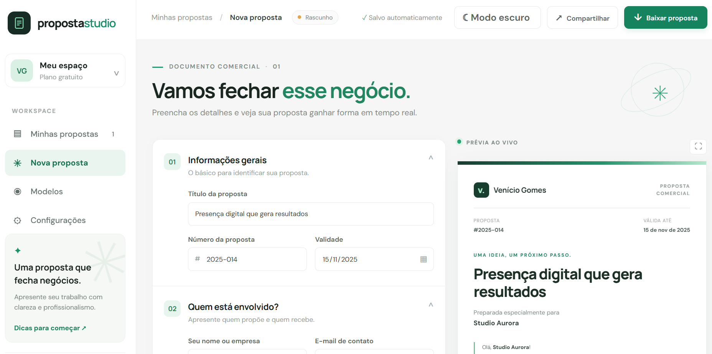

# Proposta Studio

[🌐 Acessar o Proposta Studio](https://venicio1.github.io/Proposta-Studio/)

Uma ferramenta web que desenvolvi para facilitar a criação de propostas comerciais. A ideia é reunir em um só lugar as informações do serviço, os valores e as condições do projeto, enquanto a proposta é atualizada na tela.

## O que dá para fazer

- Preencher os dados do cliente e da proposta
- Adicionar serviços com descrição e valor
- Escolher entre três modelos visuais
- Alternar entre tema claro e escuro
- Salvar o rascunho no navegador e continuar depois
- Imprimir a proposta ou salvá-la em PDF

## Como funciona

O projeto foi feito com HTML, CSS e JavaScript, sem frameworks. Os dados ficam salvos localmente no navegador e não são enviados para um servidor.

Para testar, abra `index.html` em um navegador. Depois, preencha a proposta e use **Baixar proposta** para imprimir ou salvar como PDF.

  

